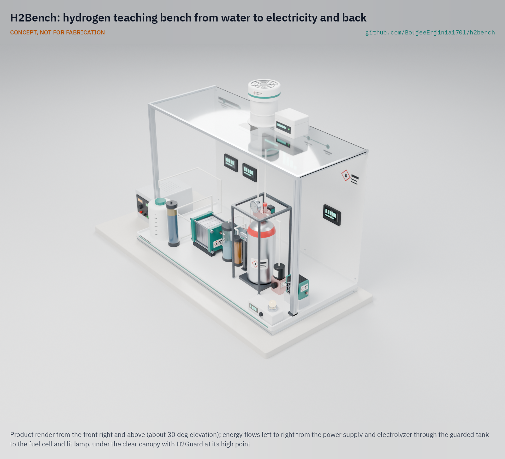

# H2Bench

     

**Area:** Hydrogen · **TRL:** 3 of 9 (proof of concept on paper) · **Value-engineering target:** USD 885 (estimated cost USD 1056) · **Difficulty:** 4 of 5

A teaching bench that splits water with a small electrolyzer, stores a few liters of hydrogen at low pressure and runs a fuel cell, with meters so students can measure efficiency at each step. Protected by H2Guard.

[Exploded render](media/render-exploded.png) · [Front render](media/render-front.png) · [Interactive 3D model](media/viewer.html) · [Concept blueprint (PDF)](media/concept-blueprint.pdf) · [General arrangement HBN-DWG-001 (PDF)](cad/drawings/HBN-DWG-001.pdf) · [Sizing calculations](docs/04-calcs/01-sizing.md) · [Prototype build plan](docs/05-build-plan.md) · [Design decisions](docs/06-design-decisions.md) · [Review note](docs/REVIEW.md)

## Concept rationale

Measuring electricity in, hydrogen made and electricity out gives students an honest sense of where hydrogen fits and where it does not. H2Bench works at tens of watts, large enough that meter and wiring errors do not swamp the result and small enough that the whole hydrogen inventory (about 7.9 L at up to 300 kPa gauge) could be released into a classroom without approaching a flammable mixture. A rigid buffer tank lets students count the hydrogen with the gas law, and the same pressure feeds the fuel cell without a compressor.

It is open and garage-buildable because the barrier for schools is cost and trust. A branded 12 W fuel cell stack alone lists at $482 to $576 ([Fuel Cell Shop](https://www.fuelcellshop.com/7-types-of-small-fuel-cell-by-price-point/t1363?currency=usd), [Fuel Cell Store](https://www.fuelcellstore.com/horizon-12-watt-pem-fuel-cell)), well over half the whole $850 bench budget, and a sealed kit cannot be inspected by a safety officer. Every part of H2Bench is off the shelf, the design files are under CERN-OHL-S-2.0, and its safety chain is the portfolio's own open H2Guard detector and interlock.

## Burning platform

Hydrogen is moving from strategy to construction faster than the people who can judge it are trained. Global hydrogen demand was almost 100 Mt in 2024, but low-emissions hydrogen was still less than 1 % of production, and installed water electrolysis capacity was only about 2 GW ([IEA, Global Hydrogen Review 2025](https://www.iea.org/reports/global-hydrogen-review-2025/executive-summary)). The European Union alone aims to produce 10 Mt of renewable hydrogen a year by 2030 ([European Commission](https://energy.ec.europa.eu/topics/eus-energy-system/hydrogen_en)).

The workforce to build this is short: more than half of some 700 energy companies, unions and training institutions surveyed by the IEA report critical hiring bottlenecks ([IEA, 2025](https://www.iea.org/news/energy-employment-has-surged-but-growing-skills-shortages-threaten-future-momentum)). And the key number every student should leave with is sobering: converting electricity to hydrogen and back with fuel cells returns only 27.4 to 48 % of the energy ([Oxford Institute for Energy Studies, 2025](https://www.oxfordenergy.org/wpcms/wp-content/uploads/2025/07/ET48-Power-to-Hydrogen-to-Power.pdf)). H2Bench lets them measure it.

## Where it could be used

### By industry

| Industry | Use |
| --- | --- |
| Secondary and vocational schools | A practical that follows one packet of energy from electricity to hydrogen and back, with students calculating each efficiency |
| Hydrogen technician training | Safe-handling drills on real hardware: purge, leak check, interlock test and shutdown |
| Universities | Electrochemistry and energy labs: polarization curves, Faraday efficiency, gas law and uncertainty analysis |
| Energy utilities and project developers | Induction training for staff moving from gas, power or oil into hydrogen projects |
| Science centers and outreach | Supervised demonstrations of hydrogen production and use, with a visible lamp load |
| Public sector and policy training | Showing decision makers the measured round-trip loss behind hydrogen storage proposals |

### By country or region

| Country or region | Why it matters there |
| --- | --- |
| European Union | Targets 10 Mt of domestic renewable hydrogen and 10 Mt of imports a year by 2030 ([European Commission](https://energy.ec.europa.eu/topics/eus-energy-system/hydrogen_en)), which needs technicians across member states. |
| United States | The DOE Hydrogen Program names teachers and students as target audiences and notes "a general lack of awareness of hydrogen as an energy alternative" ([US DOE](https://www.hydrogen.energy.gov/program-areas/education)). |
| India | The National Green Hydrogen Mission targets 5 Mt a year by 2030 and projects over 600,000 jobs; about 5,600 people had been certified in hydrogen skills ([PIB, Government of India](https://www.pib.gov.in/PressNoteDetails.aspx?id=155990&NoteId=155990&ModuleId=3)). |
| China | Holds 65 % of global installed electrolysis capacity ([IEA, 2025](https://www.iea.org/reports/global-hydrogen-review-2025/executive-summary)), the largest base of electrolyzers that trained operators will run. |
| Chile | Its national strategy aims to produce the world's most cost-competitive green hydrogen by 2030 and to rank among the three leading exporters by 2040 ([IEA policy database](https://www.iea.org/policies/12973-national-strategy-for-green-hydrogen)). |
| Namibia | The vice-chancellor of the Namibia University of Science and Technology has warned of a talent gap of up to 130,000 green hydrogen workers by 2040 ([The Namibian, 2025](https://www.namibian.com.na/namibia-risks-130-000-worker-shortage-in-green-hydrogen-sector/)); the university's IGNITE GH2 project is retraining 685 unemployed graduates and 40 instructors ([NUST, 2026](https://www.nust.na/igniting-namibias-green-hydrogen-dream-science-building-national-tvet-workforce-green-hydrogen)). |

## What sparked the idea

The idea traces back to William Grove's gaseous voltaic battery, first described in 1842 ([Grove, *Philosophical Magazine* 21, 1842](https://doi.org/10.1080/14786444208621600)). Grove recombined hydrogen and oxygen on platinum electrodes in dilute sulfuric acid to make a current, and he used that current to decompose water, running the cycle in both directions on one bench. His 1843 paper to the Royal Society set out to establish "the rationale of its action" by experiment and reports the battery decomposing water, among other compounds ([Grove, *Philosophical Transactions* 133, 1843](https://doi.org/10.1098/rstl.1843.0009)). H2Bench takes the same loop, electricity to hydrogen and back, and adds what a classroom needs that Grove's apparatus lacked: a meter at every stage, a counted quantity of gas and a hardwired safety chain.

## Problem

Students hear about the hydrogen economy but rarely measure it. Teaching kits are either toys or costly lab systems, and neither shows round-trip losses clearly. Branded 12 W fuel cell stacks alone list at about $480 to $580, and schools need detection and ventilation before they will host any hydrogen rig.

## Concept

A teaching bench that splits water with a small electrolyzer, stores a few liters of hydrogen at low pressure and runs a fuel cell, with meters so students can measure efficiency at each step. Protected by H2Guard.

In one lesson a 70 W PEM electrolyzer fills a 2 L tank from 70 to 300 kPa gauge in 17.7 min; a 12 W class fuel cell then runs a lamp at 10.8 W for 29.0 min. Students log every stage at 1 Hz and find a round trip of about 25 % (HHV basis), each stage measurable to within ±2 %. These are paper figures from the TRL 3 sizing note HBN-CAL-001, not measurements.

At TRL 3 the design meets eleven of its sixteen requirements on paper. Value-engineering target: USD 885. Estimated cost of the constructable design: USD 1056 (USD 171 over the target). The H2Guard interlock, electrolyzer back-pressure and hydrogen purity at the fuel cell are at risk. The model now carries the decisions of 2026-10-02: a catalytic deoxidizer between the separator and the drier, a 10 mm deck, and the bench supply beside the bench, which brings the bench to 24.4 kg (R13 met) ([design decisions register](docs/06-design-decisions.md)); see [docs/REVIEW.md](docs/REVIEW.md).

Full design precis: [docs/02-concept.md](docs/02-concept.md)

## Key components

- PEM electrolyzer stack, about 70 W (under 100 W)
- 2 L buffer tank at up to 300 kPa gauge, with a 310 kPa gauge supply cut, a 325 kPa gauge relief valve, pressure and temperature sensing (metal hydride and gasbag kept as options)
- PEM fuel cell, 12 W class (under 50 W), with regulator and solenoid valve
- Power meters on each stage, with a logger and display
- Water deionizer cartridge and reservoir
- H2Guard detector and interlock, sensing at the high point of a canopy hood
- Bench frame and canopy hood

The priced bill of materials is in [bom/bom.csv](bom/bom.csv). Value-engineering target: USD 885, with the bench supply in the kit. Estimated cost of the constructable design: USD 1056 (USD 171 over the target); USD 991 without the bench power supply; H2Guard excluded. See [docs/REVIEW.md](docs/REVIEW.md).

## Building the prototype

The design is constructable: every part can be cut, folded, drilled or bought, and fastens to the parts next to it ([HBN-DDR-003](docs/decisions/0003-design-for-construction.md)). The bench is a slotted aluminium extrusion frame under a 12 mm HDPE deck, with four posts and a top frame carrying the polycarbonate canopy and the printed instrument panel; every component stands on a small folded or cut mount screwed to the deck. The [prototype build plan](docs/05-build-plan.md) shows each component's making sketch, every joint and all 14 assembly steps in pictures, with the leak, cut-switch and interlock checks that come before any hydrogen is made. Decisions still open are in the [design decisions register](docs/06-design-decisions.md).

## Safety

> Hydrogen is flammable from about 4 to 74 % in air and ignites very easily. Keep storage small and at low pressure (about 7.9 L at up to 300 kPa gauge), use only pressure parts rated 1 MPa or more, keep air out of the tank, and operate only with H2Guard active and under supervision. The power supply is mains powered; use an RCD or GFCI. Research and teaching use only; not certified laboratory equipment.

## Repository layout

| Folder | Contents |
| --- | --- |
| `docs/` | Problem, concept, requirements, calculations and design decisions |
| `cad/src/` | build123d Python source, the source of truth for all geometry |
| `cad/step/`, `cad/stl/` | Exported models for FreeCAD, other CAD tools and printing |
| `cad/drawings/` | 2D sketches and dimensioned drawings |
| `bom/` | Bill of materials |
| `electronics/` | KiCad schematics and PCB layouts |
| `firmware/` | Microcontroller code |
| `media/` | Renders, perspectives and photos |
| `build-log/` | Dated prototyping notes |

## Documentation

Controlled documents follow the portfolio [documentation standard](.kit/STANDARDS.md). Each carries a document ID (HBN-PRC-001 for the precis), a version and a revision history. Branded PDFs are built with `python .kit/render.py` and attached to GitHub Releases when a document is tagged, for example `HBN-PRC-001/v1.0`.

## Credits

Designed by Amish Chadha. See [CONTRIBUTORS.md](CONTRIBUTORS.md) for roles. To cite this design, use [CITATION.cff](CITATION.cff) (GitHub shows it as "Cite this repository").

AI assistance (Claude) was used to accelerate concept renders, prototype documentation and first-pass sizing calculations. Design direction and all decisions are Amish Chadha's, recorded in this repository's decision records (`docs/decisions/`).

## Licenses

- **Hardware** (CAD, drawings, BOM, electronics): [CERN-OHL-S v2](LICENSE)
- **Software** (firmware, scripts, notebooks): [MIT](LICENSE-SOFTWARE)

A project of the [Design Molecule](https://designmolecule.com) lab.
