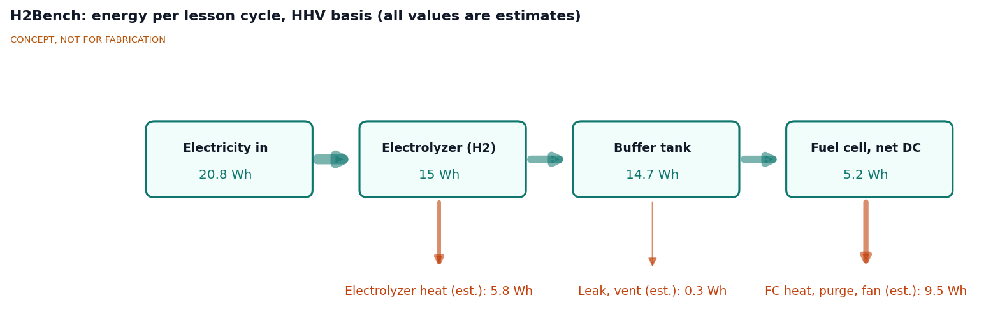
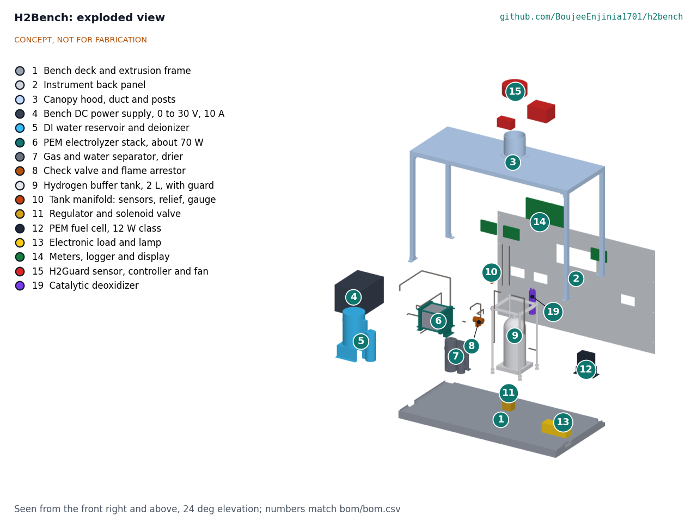
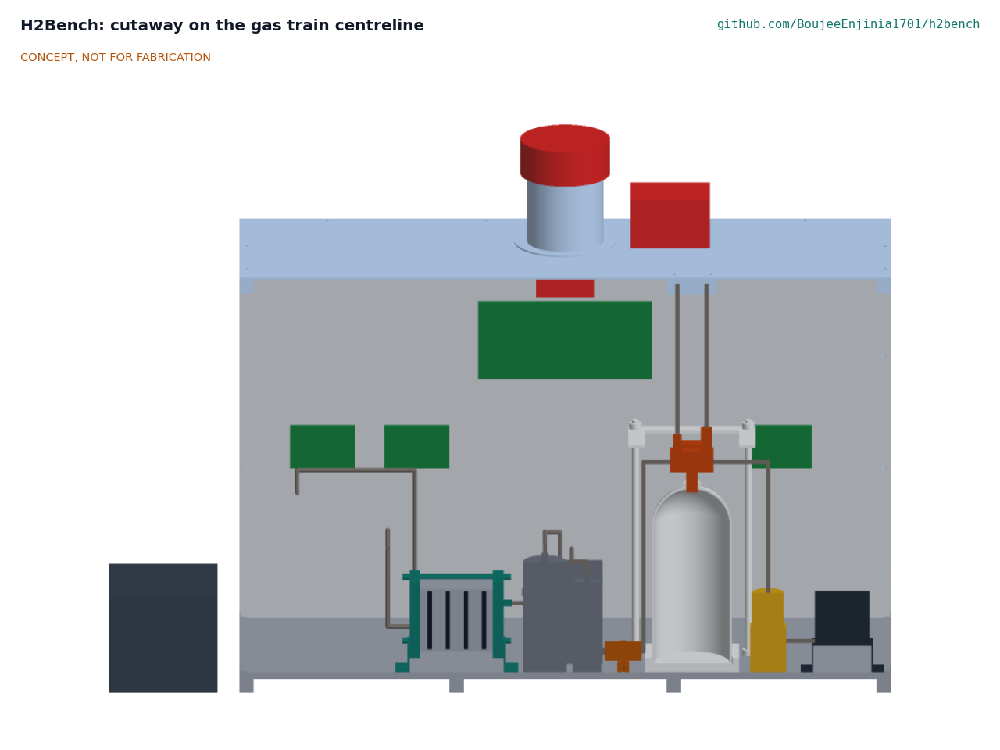

# H2Bench design precis

## Summary

H2Bench is a teaching bench that turns about 21 Wh of electricity into about 4.5 L of usable hydrogen in an 18 min fill, holds it in a 2 L tank at up to 300 kPa gauge (supply cut at 310 kPa gauge, relief at 325 kPa gauge), and returns about 5 Wh through a 12 W class fuel cell over about 29 min. Every stage is metered, so students measure a round-trip efficiency of about 25 % (estimate, HHV basis) from their own data and see where the other 75 % goes. The bench sits on an existing lab table under a canopy hood and runs only while the portfolio's H2Guard detector, extraction fan and interlock are active. All figures are checked in the calculation note HBN-CAL-001; they are paper estimates, not measurements.

*Figure 1. H2Bench on an existing lab table with a 1.75 m person for scale. Energy flows left to right: power supply, water, electrolyzer, gas treatment, buffer tank, regulator, fuel cell and lamp. Constructable model from `cad/src/model.py` (HBN-DDR-003).*

## How it works

A lesson runs in two halves.

1. **Fill (about 18 min).** The bench power supply (4) drives the PEM electrolyzer stack (6) in constant-current mode at about 9 A and 7.8 V. Deionized water from the reservoir (5) is split: oxygen vents into the hood, and hydrogen passes through the separator (7), the catalytic deoxidizer (19) and the drier (7), the check valve and flame arrestor (8), and into the buffer tank (9). The electrolyzer pushes the tank from 70 to 300 kPa gauge on its own; there is no compressor. If the fill is not stopped at 300 kPa gauge, a pressure switch on the manifold opens at 310 kPa gauge and a relay breaks the supply line, so the relief valve (325 kPa gauge) is only a backup. The cut is hardwired and does not depend on the logger firmware. Students log current, voltage, tank pressure and temperature, and compute the hydrogen made from the gas law and from Faraday's law. The difference is the Faraday efficiency.
2. **Discharge (about 29 min).** The solenoid valve and regulator (11) feed the fuel cell (12) at about 50 kPa gauge. The fuel cell runs the electronic load and lamp (13) at about 1.5 A. Students log power out and tank pressure fall, and plot the fuel cell's polarization curve by stepping the load.

The meters and logger (14) record every quantity at 1 Hz to a CSV file. The H2Guard sensor at the high point of the canopy hood (15) watches for hydrogen; on alarm it cuts the power supply output, closes the tank solenoid and runs the extraction fan at full speed.

*Figure 2. Energy per lesson cycle, HHV basis, from HBN-CAL-001. All values are paper estimates: electrolyzer 72.2 % (voltage efficiency 75.9 %, Faraday efficiency 95 %), 2 % lost to leaks and venting in storage, fuel cell 35.5 % net (0.60 V per cell, 95 % fuel utilization, 0.9 W fan and controls).*

## Main components

Table 1. Main components. Numbers match `bom/bom.csv` and Figure 3.

| No. | Component | Function | Key figure (estimate) |
| --- | --- | --- | --- |
| 1 | Bench deck and extrusion frame | Carries everything, sits on the lab table | 900 x 450 mm |
| 2 | Instrument back panel | Printed energy-chain schematic; carries the meters | 570 mm tall |
| 3 | Canopy hood, duct and posts | Collects rising hydrogen at one point for sensing and extraction | 100 mm duct |
| 4 | Bench DC power supply | Constant-current drive for the electrolyzer | 0 to 30 V, 0 to 10 A |
| 5 | DI water reservoir and deionizer | Feed water at 1 µS/cm or less | About 3.4 g water used per fill |
| 6 | PEM electrolyzer stack | Splits water; pressurizes the tank | 4 cells, about 70 W, about 250 mL/min H2 |
| 7 | Gas and water separator, drier | Returns water; dries the hydrogen | Silica gel with indicator |
| 8 | Check valve and flame arrestor | Stops backflow and flame propagation into the stack | 7 kPa cracking pressure |
| 9 | Hydrogen buffer tank with guard | Stores the lesson's hydrogen | 2 L, 300 kPa gauge working, rated 1 MPa or more |
| 10 | Tank manifold | Pressure and temperature for the gas law; relief; gauge; vent needle valve; high-pressure cut switch | Cut at 310 kPa gauge; relief at 325 kPa gauge; vent in 3 min or more |
| 11 | Regulator and solenoid valve | Feeds the fuel cell; closes on alarm or power loss | About 50 kPa gauge out |
| 12 | PEM fuel cell | Converts hydrogen back to electricity | 12 W class, 13 cells, 154 mL/min H2 supplied |
| 13 | Electronic load and lamp | Steps the load for polarization curves; shows the output | 0 to 3 A |
| 14 | Meters, logger and display | Three power monitors, pressure and temperature, CSV at 1 Hz; relay that breaks the electrolyzer supply when the line 10 switch opens | ±1 % power; relay 10 A DC or more |
| 15 | H2Guard sensor, controller and fan | Detection, extraction and interlock (H2Guard project) | See H2Guard |
| 19 | Catalytic deoxidizer | Reacts oxygen carried across the stack membrane back into water before the drier | Palladium cartridge, 32 x 120 mm; assumed 99 % conversion |

*Figure 3. Exploded view with BOM numbers.*

*Figure 4. Section on the gas train centreline, looking from the front. Left to right: power supply (4), electrolyzer (6) with its four membrane electrode assemblies between titanium plates, separator, deoxidizer and drier (7 and 19), check valve and flame arrestor (8), buffer tank (9) shown hollow inside its rod guard with the manifold (10) and the relief line rising to the canopy, regulator and solenoid (11) and fuel cell (12).*

The general arrangement, with the main dimensions and interfaces, is drawing HBN-DWG-001 Rev P4 ([`cad/drawings/HBN-DWG-001.pdf`](../cad/drawings/HBN-DWG-001.pdf)); STEP and STL exports are in `cad/step/` and `cad/stl/`.

## First-order numbers

The numbers below are checked in HBN-CAL-001 (`docs/04-calcs/01-sizing.md`), which also holds the assumptions and the results table against every requirement.

Table 2. Energy and gas per lesson cycle (HBN-CAL-001).

| Quantity | Value | Assumption |
| --- | --- | --- |
| Electrolyzer input | 70.2 W for 17.7 min, 20.8 Wh | 4 cells, 1.95 V per cell, 9 A |
| Hydrogen produced | 0.189 mol, 4.5 L at 20 °C, 15.0 Wh (HHV); 256 mL/min | Faraday efficiency 95 %; HHV 285.8 kJ/mol |
| Electrolyzer efficiency | 72.2 % (HHV) | Voltage efficiency 1.48 V / 1.95 V = 75.9 % |
| Compression penalty | 17.4 mV per cell, under 1 % | Electrochemical, 1 to 4 bar absolute on the H2 side |
| Tank content at 300 kPa gauge | 0.33 mol, 7.9 L at 20 °C, 0.66 g (8.5 L with the lines) | 2.000 L at 401 kPa absolute, 20 °C; 0.15 L outside the tank |
| Inventory at the relief setting | 9.0 L; 9.9 L at full relief lift on a 15 °C day | Relief 325 kPa gauge, 10 % overpressure at full lift |
| Usable swing | 300 down to 70 kPa gauge, 0.189 mol | Regulator needs about 20 kPa headroom above the fuel cell supply |
| Storage loss | About 2 %, 0.3 Wh | Leaks, purge of the lines; to be measured |
| Fuel cell output | 11.7 W gross, 10.8 W net, for 29.0 min, 5.2 Wh; 154 mL/min supplied | 13 cells at 0.60 V and 1.5 A; 95 % utilization; 0.9 W fan and controls |
| Fuel cell efficiency | 35.5 % net (HHV), 42.0 % (LHV) | Consistent with the 40 % system efficiency listed for the 12 W class ([Fuel Cell Store](https://www.fuelcellstore.com/horizon-12-watt-pem-fuel-cell)) |
| Round trip | 25.1 % (HHV) | Just below the 27.4 to 48 % range in [OIES (2025)](https://www.oxfordenergy.org/wpcms/wp-content/uploads/2025/07/ET48-Power-to-Hydrogen-to-Power.pdf), as expected at 12 W scale with a dead-end fuel cell |
| Heat released | About 20 W at the electrolyzer, about 19 W at the fuel cell | Losses in Figure 2 divided by run time |
| Oxygen vented | 2.3 L per fill | Half the hydrogen moles |
| Total release into a 30 m³ room | 0.030 % by volume, 0.75 % of the 4 % lower flammable limit | Relief-set inventory, well mixed |
| Venting 300 to 20 kPa gauge | 5.9 L over 3.0 min through the needle valve; peak 0.35 % by volume at the duct | 60 m³/h hood extraction |
| Stored pressure energy | 646 J (710 J at the relief setting) | Isentropic expansion of 2 L to 101 kPa absolute |
| Stored chemical energy | About 94 kJ (HHV), 80 kJ (LHV) | 0.33 mol |
| Hydrogen measurement | ±1.5 % per fill; each stage efficiency within ±1.8 % | 0.25 % FS transducer on 600 kPa, ±1 K, tank volume calibrated by water fill to ±1 % |
| Envelope and mass | 900 x 450 x 753 mm; 24.4 kg for the bench as moved, supply beside it (27.4 kg with the supply) | `cad/src/model.py`; mass estimate in HBN-CAL-001 |
| Parts cost | USD 1056, or USD 991 without the bench supply; USD 171 over the USD 885 value-engineering target | `bom/bom.csv`; H2Guard excluded |

The numbers show that one 90 min lesson holds a full cycle with 13 min to spare (R2), the round trip lands where published studies say it should, and students can measure each stage to better than ±2 %, so the bench teaches the right lesson. They also show three requirements at risk: the H2Guard interlock (R8), electrolyzer back-pressure (R10) and hydrogen purity at the fuel cell (R9, now with a deoxidizer fitted but no supplier data). Mass (R13) is met at 24.4 kg once the deck is 10 mm and the supply stands beside the bench. The 325 kPa gauge relief brings the inventory (R5) to met.

## Key design choices

Choices 1 to 10 are **decided by Amish, 2026-09-25: go with recommendation** (HBN-DDR-002). The open items are listed at the end of this section.

1. **Storage: rigid 2 L buffer tank at up to 300 kPa gauge.** Decided (HBN-DDR-002 D1). Options were: (a) rigid tank, pressurized by the electrolyzer; (b) metal hydride canister (stores more at lower pressure, but slow, costly and hides the gas law); (c) near-atmospheric gasbag or water-displacement gas holder with a small pump to feed the fuel cell. (a) was chosen because the fuel cell needs about 45 to 55 kPa gauge supply ([Fuel Cell Store](https://www.fuelcellstore.com/horizon-12-watt-pem-fuel-cell)) and pressure and temperature give students a direct measurement of the hydrogen. Condition: the electrolyzer must hold the back-pressure, 332 kPa over its oxygen side at the relief setting (R10, HBN-CAL-001); if not, fall back to (c).
2. **PEM electrolysis with deionized water, not alkaline.** Decided (HBN-DDR-002 D2). Alkaline cells are cheaper but need potassium hydroxide, a caustic electrolyte.
3. **Generic 12 W class fuel cell rather than a branded stack.** Decided (HBN-DDR-002 D3). A branded 12 W stack lists at $482 to $576; a generic stack is estimated at about $250, with a published polarization curve and a purity tolerance as purchase conditions; branded as the fallback.
4. **Measure hydrogen by pressure, volume and temperature, not by a mass flow meter.** Decided (HBN-DDR-002 D4). It is cheaper, and the gas law is itself a lesson. A mass flow meter could be an upgrade for university labs.
5. **Bench power supply in constant-current mode as the source.** Decided (HBN-DDR-002 D5). A small solar panel could be added later to show renewable-to-hydrogen; not in the first version.
6. **H2Guard as a hard dependency, costed in its own project and shipped with the bench.** Decided (HBN-DDR-002 D6). The bench cannot run without it.
7. **Tank kept above about 20 kPa gauge between lessons** so air cannot enter; a new or opened tank is purged with hydrogen by pressure cycling before first use (three fill and vent cycles to 300 kPa gauge reduce the air fraction to about 1.6 %). Decided (HBN-DDR-002 D7).
8. **Canopy hood with a single high point** so the sensor sees any leak first and the fan extracts it. Decided (HBN-DDR-002 D8).
9. **Value-engineering target of USD 885 with the bench power supply in the kit**, H2Guard costed in its own project. Decided (HBN-DDR-002 D9 and D10); `budget_usd` rose from $450 to $850, and to $885 on 2026-09-26; on 2026-10-01 Amish set it as a hypothetical control target, not a limit. Estimated cost of the constructable design: USD 999 (USD 114 over the target).
10. **Pressure protection and venting.** Relief valve at 325 kPa gauge (was 350) so the inventory stays under 10 L even at full lift; a pressure switch that cuts the supply at 310 kPa gauge so the relief valve is a backup only; vent needle valve set for 3 min or more; plug-in 30 mA RCD (BOM line 18). Decided (HBN-DDR-002 D11 to D14).

Open decisions, with options and recommendations, are kept in the design decisions register ([docs/06-design-decisions.md](06-design-decisions.md)). The constructable design, with the parts added so the bench can be built (four posts and a top frame, mounts for every component, water lines), is in HBN-DDR-003, and the build plan is [docs/05-build-plan.md](05-build-plan.md).

## Safety

> **Safety:** Hydrogen is flammable in air from about 4 to 74 % by volume and ignites with about 0.02 mJ, far less than most fuels; its flame is hard to see in daylight ([US DOE](https://www1.eere.energy.gov/hydrogenandfuelcells/pdfs/h2_safety_fsheet.pdf)). H2Bench is a research and teaching prototype, not certified laboratory equipment. Run it only under supervision, only with the H2Guard detector, fan and interlock active and tested, and never near open flames, heaters or sparking tools.

> **Safety:** The tank and lines are under pressure (up to 300 kPa gauge, supply cut at 310 kPa gauge, relief at 325 kPa gauge). Check that the pressure switch cuts the supply before each lesson series. Use only vessels and fittings rated 1 MPa or more and rated for hydrogen; never use plastic bottles. Keep the tank inside its guard, pipe the relief valve and manual vent into the hood, and never open a fitting while the system is pressurized.

> **Safety:** Vent slowly through the needle valve (3 min or more from 300 to 20 kPa gauge). A faster vent can raise the concentration at the duct past H2Guard's warning level (HBN-CAL-001 section 7).

> **Safety:** Keep air out of the tank. A hydrogen and air mixture inside a closed vessel can burn or detonate. Purge a new or opened tank with hydrogen by pressure cycling, and never vent it below about 20 kPa gauge.

> **Safety:** Drain the separator by hand only at the 20 kPa gauge holding pressure, under the hood, with H2Guard running (decided 2026-10-02).

> **Safety:** Run the bench first as an instructor-run class demonstration. Move to student group practicals only after a recorded run of attended fills, with H2Guard tested before each (decided 2026-10-02).

> **Safety:** The oxygen outlet of the electrolyzer must vent to the hood, away from the hydrogen outlet, so oxygen and hydrogen can never mix in a line.

> **Safety:** The bench power supply is mains powered. Use a supply with a protective earth, keep the mains lead off the wet deck, and fit a residual-current device (RCD or GFCI) on the bench socket. Water and electricity share the deck; keep the reservoir below and away from the supply.

> **Safety:** The electrolyzer and fuel cell stacks run warm (about 20 W of heat each) and the fuel cell's maximum stack temperature is about 55 °C. Allow cooling before handling.

## Open questions

- [ ] Can a generic electrolyzer stack at this size hold 332 kPa on the hydrogen side over the oxygen side, the relief setting plus the check valve (R10, HBN-CAL-001)?
- [ ] What hydrogen purity reaches the fuel cell after the separator and drier, and does the chosen fuel cell tolerate it (R9)? Decided 2026-10-02: a catalytic deoxidizer is fitted between separator and drier, and removed only if the stack supplier's data show oxygen within the 99.995 % limit at the lowest operating current.
- [ ] H2Guard alarm set point and response time; how the interlock reaches the power supply output and the solenoid (R8).
- [x] Tank: decided 2026-10-02, a certified aluminium cylinder (6061-T6 class) of about 2 L with a stamped working pressure of 1 MPa or more and a threaded neck; stainless only if a rated cylinder of about 1.0 kg or less is found.
- [ ] Is a 300 kPa gauge tank acceptable to school safety officers, or is option (c) (near-atmospheric storage with a pump) needed?
- [x] Curriculum and age group: decided 2026-10-02, post-16 vocational learners on hydrogen or renewable energy technician courses, aligned to the electrochemistry, gas safety and efficiency units of the first partner college's course. The first use is an instructor-run class demonstration; group practicals follow a recorded run of attended fills with H2Guard tested before each.
- [x] Budget for the kit: set to $885 by Amish on 2026-09-26, and on 2026-10-01 made a value-engineering target (R14).
- [ ] Which H2Guard output breaks the 9 A supply line, and at what voltage the tank solenoid runs (R8)? Decided 2026-10-02 to propose to H2Guard: a 24 V normally closed tank solenoid powered directly from H2Guard, and H2Guard's alarm contact in series with the 310 kPa cut relay; awaiting H2Guard.

Concept media: [blueprint sheet](../media/concept-blueprint.pdf), [interactive 3D model](../media/viewer.html).
